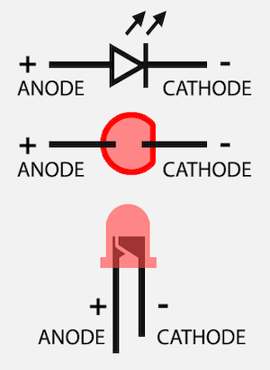

# Agora/Hachette Terminator T-800 Eye Modification
An eye modification for the Agora/Hachette T-800 1:2 size Endoskeleton model. Having installed the epic modification from [Alex McPherson](https://t800controller.com/demos.html) to my T-800 endoskeleton, I used the spare parts and an Arduino Nano controller to provide some fading eyes as broken remains of T-800s laying on the battlefield at the feet of my T-800.

If you have the stock items without modification, it would be possible to modify the stock build to automatically move the eyes left and right randomly and to have them on permanently. As I have modified my T-800 I am not able to show that.

There is potentially some soldering to do depending how you want to proceed. I will provide a parts list I used, the wiring diagram and how to program an Arduino from the code.

The start of this video shows the fading eyes effect added to the base of my T-800 Endoskeleton.



## Instructions

First some parts:

* An Arduino Nano. I used one from [Ebay](https://www.ebay.co.uk/itm/Nano-V3-0-Arduino-ATmega328-5V-16MHz-CH340-UNSOLDERED-HEADERS-UK-Stock-/323825474433) but also ran some tests using an official one from somewhere like [The PI Hut](https://thepihut.com/products/arduino-nano) which is *much more expensive* (but has pins soldered).
* Some resistors to protect each eyes from full voltage. The Arduino puts 5v to each IO pin which is too much for red LEDs which require about [1.8-2.1v](https://www.digikey.co.uk/en/resources/conversion-calculators/conversion-calculator-led-series-resistor). I used these 2.7K-ohm from [EBay](https://www.ebay.co.uk/itm/1-4W-Metal-Film-Resistors-1-186-values-available-20-Pack-UK-Seller-Free-P-P-/263898843941?).
* A switch to control whether the Arduino Nano is on or off. This one on [Ebay](https://www.ebay.co.uk/itm/Small-Mini-Black-On-Off-Rocker-Switch-Rectangle-SPST-12V-All-Quantities-/251390016446) matches the main on-off switch of the base. If you are modifying the head, you can drive the Nano from the battery pack, or from one of the power modifications available.
* Some AWG 24 wiring to connect things together. Either [multi-core](https://www.amazon.co.uk/dp/B07TT69PPV/) or [solid core](https://www.amazon.co.uk/gp/product/B08BZKVVH2/). These options provide much more than required, depending on your needs.
* Some Heat Shrink tubing. I bought [this example on Amazon](https://www.amazon.co.uk/dp/B08N5246YB) which is good. Alternatives from Ebay might be cheaper. Again much more than you need, but could be useful depending on your needs.
* Eyes and their servo either part of your head already (if you're modifying the head) or replacement parts from [issue 1](https://hachettepartworks.com/en-en/terminator-build-the-t800/the-terminator-build-the-t-800-issue-1/) and [issue 18](https://hachettepartworks.com/en-en/terminator-build-the-t800/the-terminator-build-the-t-800-issue-18/).

You will also need a soldering iron and some solder to connect things together.

## Wiring diagram

The [t800-eyes](https://github.com/jsware/t800-eyes) program for the Arduino supports three sets of eyes, so you can control the eyes in the head along with two sets added to the base if you wish. This diagram only shows one set of eyes on pin 5 and servo on pin 9:


* Pins 5, 6 and 7 control the LEDs. Pins 5 and 6 cycle through powering up, flickering and fading away. They run on independent random cycles. Pin 7 is always on.
* Pins 9, 10 and 11 control the servos. Pins 9 and 10 move randomly left and right synchronised with LED flickering (pins 9 + 5 and 6 + 10 are synchronised). Pin 11 scans left and right repeatedly.
* I also have two switches - U1 and U2. U1 allows you to switch all the eyes and servos on/off. U2 (optional) would allow you to have the eyes on, but the servos unpowered so they do not move.

You do not have to wire all the LED and servo pins, nor do you have to keep them together. You could wire the head eyes to pin 7 and their servo to pins 9 or 10 so they move randomly (they will pause momentarily every now and then) so your terminator can look around. Alternatively you can wire the eye servo to pin 11 so the Terminator scans the room left and right.

One note of caution. The stock LEDs that come with the model *seem to be wired incorrectly*. Look at these images to see what I mean:




As you can see the black negative wire would normally be connected to the cathode side with a flat edge.

However, with the eyes from the model the positive (red) wire is connected to the cathode (negative) side with the flat edge.

When connecting the resistors, I switched the red and black when extending the wiring. The two resistors are covered with heat shrink tubing and you'll notice the black wire becomes red and red becomes black in the top left of the picture:


## Arduino Nano

Configuring the arduino Nano is easy. This modification comes with a simple Arduino IDE program to control the LEDs and servos. To program your Arduino you will need to follow a few steps to load the program.

1. Use the [Arduino Getting Started Guide](https://www.arduino.cc/en/Guide) to load up the Arduino IDE.
1. Download the [t800-eyes](https://github.com/jsware/t800-eyes) program from GitHub. Alternatively copy the code below into a new Arduino project.
1. Once you understand how to load simple programs (from the getting started and tutorials) to an Arduino Nano, you can load this modification program to control the LEDs. I would recommend trying out the standard "Blink" program first to ensure you can in principle compile and transfer it to the Nano. Ardunio basics are beyond the scope of this page, but there is plenty of help available via [Google](https://www.google.com/search?q=arduino+hello+world).
1. You will need some additional libraries. From the Arduino menu select Tools -> Manage Libraries and then search for:
  * [ServoEasing](https://github.com/ArminJo/ServoEasing) v2.3.4 by Armin Joachminseyer.
  * [AsyncTimer](https://github.com/Aasim-A/AsyncTimer) v2.2.0 by Aasim-A.
  * [JLed](https://github.com/jandelgado/jled) v4.8.0 by Jan Delgado.

Once these libraries are installed, the program should compile successfully.

Programs for Arduino are written in C/C++ programming language. Its the first language I used after leaving school and I have loved it. Here is the program, which you could copy into a new project if you don't want to download from GitHub.

```cpp
/**
 * @file t800-eyes.ino
 * @author John Scott
 * @brief Terminator T-800 Flickering & Fading Eyes.
 * @version 1.0
 * @date 2022-01-10
 * 
 * @copyright Copyright (c) 2022 John Scott
 * 
 */
#include <Servo.h>        // Tools -> Manage Libraries...
#include <ServoEasing.h>  // ServoEasing v2.3.4
#include <AsyncTimer.h>   // AsyncTimer v2.2.0
#include <jled.h>         // JLed v4.8.0


//
// Eye LED settings...
//
#define LED_A 5
#define LED_B 6
#define LED_C 7

#define FADE_ON 125
#define FADE_ON_WAIT 500

#define FLICKER_TIME 2500

#define EYES_ON_WAIT 500

#define FADE_OFF 1500
#define FADE_OFF_WAIT 2500


//
// Eye Servo settings...
//
#define EYE_SERVO_A 9
#define EYE_SERVO_B 10
#define EYE_SERVO_C 11

#define EYE_SPEED 150

#define EYE_MIN 20
#define EYE_MAX 160
#define EYE_CENTER 90

#define EYE_INTERVAL 900


//
// Random eye movement...
//
AsyncTimer t;
ServoEasing eyeServoA;
ServoEasing eyeServoB;
ServoEasing eyeServoC;
unsigned short eyeTimer;
unsigned short scanTimer;
bool eyeMoveA = true;
bool eyeMoveB = true;
bool eyeMoveC = true;


//
// Eye flickering & fading movement.
//
JLed ledsA[] = {
    JLed(LED_A).FadeOn(FADE_ON).DelayAfter(FADE_ON_WAIT * 2),
    JLed(LED_A).Candle(6, 100, FLICKER_TIME * 2),
    JLed(LED_A).On().DelayAfter(EYES_ON_WAIT * 2),
//    JLed(LED_A).FadeOff(FADE_OFF).DelayAfter(FADE_OFF_WAIT * 2)
};
auto seqA = JLedSequence(JLedSequence::eMode::SEQUENCE, ledsA);
auto ledA = JLed(LED_A).FadeOff(FADE_OFF).DelayAfter(FADE_OFF_WAIT * 2);

JLed ledsB[] = {
    JLed(LED_B).FadeOn(FADE_ON).DelayAfter(FADE_ON_WAIT * 2),
    JLed(LED_B).Candle(6, 100, FLICKER_TIME * 2),
    JLed(LED_B).On().DelayAfter(EYES_ON_WAIT * 2),
//    JLed(LED_B).FadeOff(FADE_OFF).DelayAfter(FADE_OFF_WAIT * 2)
};
auto seqB = JLedSequence(JLedSequence::eMode::SEQUENCE, ledsB);
auto ledB = JLed(LED_B).FadeOff(FADE_OFF).DelayAfter(FADE_OFF_WAIT * 2);


//
// Generate variation for range -> range * 2
//
int vary(int range, int v = 11) {
  return range + random(v) * range / v;
}


//
// Change JLed timings so each flicker is independent.
//
void retime(JLed (&leds)[3], JLed &led) {
  leds[0].FadeOn(FADE_ON).DelayAfter(vary(FADE_ON_WAIT));
  leds[1].Candle(6,100,vary(FLICKER_TIME));
  leds[2].On().DelayAfter(vary(EYES_ON_WAIT));
  led.FadeOff(FADE_OFF).DelayAfter(vary(FADE_OFF_WAIT));
}


//
// Random eye movement.
//
void moveEyes() {
  if(eyeMoveA) {
    eyeServoA.startEaseTo(random(EYE_MIN, EYE_MAX+1));
  }

  if(eyeMoveB) {
    eyeServoB.startEaseTo(random(EYE_MIN, EYE_MAX+1));
  }
}


//
// Scan eyes back and forth.
//
void scanEyes() {
  eyeServoC.startEaseTo(eyeMoveC?EYE_MIN:EYE_MAX);
  eyeMoveC = !eyeMoveC;
}


//
// Standard setup function.
//
void setup() {
  Serial.begin(9600); // For debugging.
  randomSeed(analogRead(0)); // Init random number generator.

  eyeServoA.attach(EYE_SERVO_A); // Init eyes.
  eyeServoA.write(EYE_CENTER);
  eyeServoA.setSpeed(EYE_SPEED);
  
  eyeServoB.attach(EYE_SERVO_B);
  eyeServoB.write(EYE_CENTER);
  eyeServoB.setSpeed(EYE_SPEED);

  eyeServoC.attach(EYE_SERVO_C);
  eyeServoC.write(EYE_CENTER);
  eyeServoC.setSpeed(EYE_SPEED / 2); // Run slower is scanning mode.

  pinMode(LED_C, OUTPUT); // Make Led C constantly on (for scanning mode). 
  digitalWrite(LED_C, HIGH);

  t.setup();
  eyeTimer = t.setInterval(moveEyes, EYE_INTERVAL);
  scanTimer= t.setInterval(scanEyes, EYE_INTERVAL * 5);
}


//
// Standard loop.
//
void loop() {
  t.handle();
  
  if(!seqA.Update()) {
    eyeMoveA = false; // Stop random eye movement when sequence ends and then we fade off.
    if(!ledA.Update()) {
      retime(ledsA, ledA);
      seqA.Reset();
      ledA.Reset();
      eyeMoveA = true; // Restart eye movement for next eye flickering sequence.
    }
  }

  if(!seqB.Update()) {
    eyeMoveB = false; // Stop random eye movement when sequence ends and then we fade off.
    if(!ledB.Update()) {
      retime(ledsB, ledB);
      seqB.Reset();
      ledB.Reset();
      eyeMoveB = true; // Restart eye movement for next eye flickering sequence.
    }
  }
}
```

Copy all the code in the black window above, replacing everything in the code window. Verify it with the Verify "tick" toolbar button in the Arduino IDE and you should get something like this:

```

Sketch uses 12756 bytes (41%) of program storage space. Maximum is 30720 bytes.
Global variables use 710 bytes (34%) of dynamic memory, leaving 1338 bytes for local variables. Maximum is 2048 bytes.

```

If you have not copied all the code (for example missed the final closing brace), you will get an error such as:

```
...t800-eyes/t800-eyes.ino: In function 'void loop()':
t800-eyes:181:3: error: expected '}' at end of input
   }
   ^
exit status 1
expected '}' at end of input
```

If you did not remove all the code in the Arduino IDE window, you may get something like this:

```
...t800-eyes/t800-eyes.ino: In function 'void setup()':
t800-eyes:142:6: error: redefinition of 'void setup()'
 void setup() {
      ^~~~~
...t800-eyes/t800-eyes.ino:1:6: note: 'void setup()' previously defined here
 void setup() {
      ^~~~~
...t800-eyes/t800-eyes.ino: In function 'void loop()':
t800-eyes:170:6: error: redefinition of 'void loop()'
 void loop() {
      ^~~~
...t800-eyes/t800-eyes.ino:6:6: note: 'void loop()' previously defined here
 void loop() {
      ^~~~
exit status 1
redefinition of 'void setup()'
```

If all is well, you should then be able to load the program onto your Arduino. Connect it to the USB port and use the following:

* Tools -> Board: **Ardino Nano**
* Tools -> Processor: **ATmega328P**
* Tools -> Port: *Select the correct port*

You can then use the (->) *Upload* toolbar button next to the (✔︎) Verify tick button.
